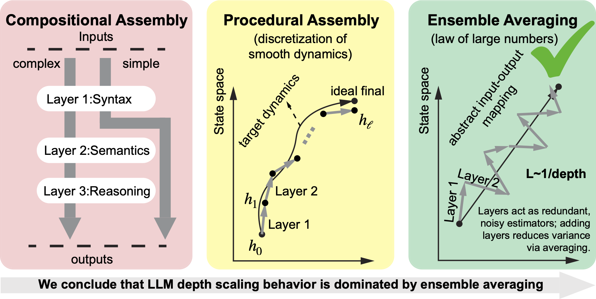

# Neural Inverse Depth Scaling: Most Layers Update Most Tokens via Ensemble Averaging

This repository contains code to reproduce the experiments in the paper [Inverse Depth Scaling From Most Layers Being Similar](https://arxiv.org/abs/2602.05970).

## Overview

<p align="center" width="100%">

</p>

Neural scaling laws relate loss to model size in large language models (LLMs), yet depth and width may contribute to performance differently, requiring more detailed studies. 

Here, we quantify how depth affects loss via analysis of LLMs and toy residual networks. We find loss scales inversely proportional to depth in LLMs, probably due to functionally similar layers reducing error through ensemble averaging rather than compositional learning or discretizing smooth dynamics. 

This regime is inefficient yet robust and may arise from the architectural bias of residual networks and target functions incompatible with smooth dynamics. The findings suggest that improving LLM efficiency may require architectural innovations to encourage compositional use of depth.

## Repository Structure

LLM hidden state experiments can be found in [LLMs](./LLMs), whose description is in Appendix A. Scaling analysis of Chinchilla models are in [Scaling](./Scaling), whose description is in Appendix B. Toy model experiments are in [exp](./exp), whose description is in Appendix C.

|Experiment| Where in [Paper](https://arxiv.org/abs/2602.05970) | Code |
|--|--|--|
|LLM Evaluations|Figure 2, a-e | [LLMs folder](./LLMs/)|
|Chinchilla Data Fitting|Figure 2f| [Scaling folder](./Scaling)|
|Toy Model | Figure 3b and Figure 4c |[exp-9](./exp/exp-9.py) and [exp-9-1](./exp/exp-9-1.py)|
|Toy Model Longer Training| Figure 4, a and b |[exp-9-3](./exp/exp-9-3.py) |
|Toy Model With MSE and Longer Training| Figure 5|[exp-9-6](./exp/exp-9-6.py) |
|Toy Model With High-order Intergration Scheme| Appendix C.3 | [exp-9-4](./exp/exp-9-4.py) |

## Citation

```
@article{liu2026inverse,
  title={Inverse Depth Scaling From Most Layers Being Similar},
  author={Yizhou Liu and Sara Kangaslahti and Ziming Liu and Jeff Gore},
  journal={arXiv preprint arXiv:2602.05970},
  year={2026}
}
```

## Interested in Other Neural Scaling Laws?

- Width Scaling Due to Limited Representation: Superposition Yields Robust Neural Scaling ([paper link](https://arxiv.org/abs/2505.10465), [code link](https://github.com/liuyz0/SuperpositionScaling/tree/main))
- Time Scaling Due to Limited Training: Universal One-third Time Scaling in Learning Peaked Distributions ([paper link](https://arxiv.org/abs/2602.03685), [code link](https://github.com/liuyz0/TimeScaling))